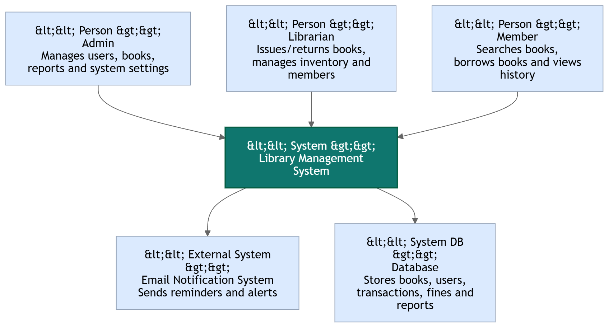

# Software Requirements Specification (SRS)

## Library Management System

---

# Preface

This document provides the Software Requirements Specification (SRS) for the **Library Management System (LMS)**. It defines the system functionalities, performance requirements, security policies, and overall architecture required for development and deployment.

---

# Version History

* **Version 1.0** – Initial Draft
* **Version 1.1** – Added system models and non-functional requirements
* **Version 1.2** – Updated database requirements and future enhancements

---

# 1. Introduction

## Purpose

The **Library Management System** is a web-based application designed to automate and simplify library operations such as book management, member registration, borrowing, returning, and reporting. The system improves efficiency, reduces manual work, and provides real-time access to library resources.

---

## Document Conventions

This document follows the IEEE SRS standard, using:

* **Must** – Indicates mandatory requirements
* **Should** – Indicates recommended features
* **May** – Indicates optional enhancements

---

## Intended Audience and Reading Suggestions

* **Developers & System Architects** – For implementation guidance
* **Library Administrators** – To understand system operations
* **Stakeholders & Analysts** – To review project scope and functionality
* **QA/Test Engineers** – To validate software requirements

---

## Scope

The system provides:

* Book catalog management
* Member registration and management
* Book issue and return tracking
* Fine calculation for overdue books
* Search and filtering functionalities
* Reporting and analytics
* Notifications and reminders
* Role-based access control

---

## References

* IEEE Standard 830-1998 (Software Requirements Specification)
* Library Business Requirement Specification (BRS)
* Database and UML Modeling Documentation

---

# 2. Overall Description

## Product Perspective

The Library Management System is a standalone web application that can integrate with barcode scanners, email services, and cloud databases.

---

## Product Functions

### Book Management

* Add, update, delete, and categorize books.

### Member Management

* Register and manage students, teachers, and staff members.

### Borrowing & Returning

* Issue books to members and track return dates.

### Fine Management

* Automatically calculate overdue fines.

### Reporting & Analytics

* Generate reports on borrowed books, fines, and inventory.

### Notifications

* Send reminders for due dates and overdue books.

---

## User Classes and Characteristics

### Admin

* Manages users, books, and system settings.

### Librarian

* Issues/returns books and manages inventory.

### Member/User

* Searches books and views borrowing history.

---

## Operating Environment

* Web-based application (Chrome, Firefox, Edge)
* Cloud-hosted or local server deployment
* Database: MySQL / MongoDB

---

## Design and Implementation Constraints

* Must comply with data privacy and security policies.
* System should support multiple users simultaneously.
* Barcode integration may require additional hardware support.

---

## Assumptions and Dependencies

* Internet connection is required for cloud deployment.
* Users must have valid accounts to access services.
* Future mobile application support may be added.

---

# 3. System Requirements Specification

# Functional Requirements

## User Authentication

* The system must allow users to register, log in, and reset passwords.
* The system must support role-based authentication (Admin, Librarian, Member).

---

## Book Management

* Librarians must be able to add, update, and remove books.
* The system must categorize books by title, author, subject, and ISBN.
* The system should support barcode-based book identification.

---

## Member Management

* Admins must be able to add and manage library members.
* Members must have unique membership IDs.

---

## Book Borrowing and Returning

* Librarians must be able to issue books to members.
* The system must track due dates and return dates.
* Members must be able to view currently borrowed books.

---

## Fine Management

* The system must automatically calculate fines for overdue books.
* Admins should be able to update fine policies.

---

## Search Functionality

* Users must be able to search books by title, author, category, or ISBN.
* The system should provide filtering and sorting options.

---

## Reporting & Analytics

* Admins must be able to generate reports on:

  * Borrowed books
  * Available inventory
  * Overdue books
  * Fine collections

* Reports should be exportable in PDF and CSV formats.

---

## Notifications

* The system must send reminders before due dates.
* The system must notify users about overdue books and fines.

---

# Non-Functional Requirements

## Performance Requirements

* The system must support 1000+ concurrent users.
* Search results should load within 2 seconds.
* Transactions must update in real time.

---

## Security Requirements

* The system must implement role-based access control.
* User passwords must be encrypted.
* Sensitive data must be protected using secure protocols.

---

## Usability Requirements

* The system should provide a user-friendly interface.
* The system must support accessibility standards.

---

## Reliability and Availability

* The system must ensure 99.9% uptime.
* Automated backup and recovery mechanisms must be implemented.

---

## Maintainability and Support

* The system should support modular architecture for updates.
* Logging and debugging mechanisms must be included.

---

## Portability

* The system should run on Windows, Linux, and MacOS.
* The system must support cloud deployment.

---

# 4. System Models

## CONTEXT DIAGRAM

# 5. System Evolution

## Assumptions

* AI-based book recommendations may be integrated.
* Mobile application support may be added in the future.
* Cloud scalability for large institutions.

---

## Expected Changes

* Integration with RFID systems
* AI-powered search and recommendations
* Online e-book management support
* Multi-language support

---

# 6. Appendices

## Hardware Requirements

* Cloud server or local hosting infrastructure
* Barcode scanner support
* Minimum 8GB RAM server environment

---

## Database Requirements

The database must include:

* Logical relationships between books and members
* Secure transaction handling
* Backup and recovery support

---

# Conclusion

The Library Management System aims to digitize and automate library operations efficiently. The system ensures secure access, easy book tracking, improved reporting, and enhanced user experience while supporting future scalability and integrations.
